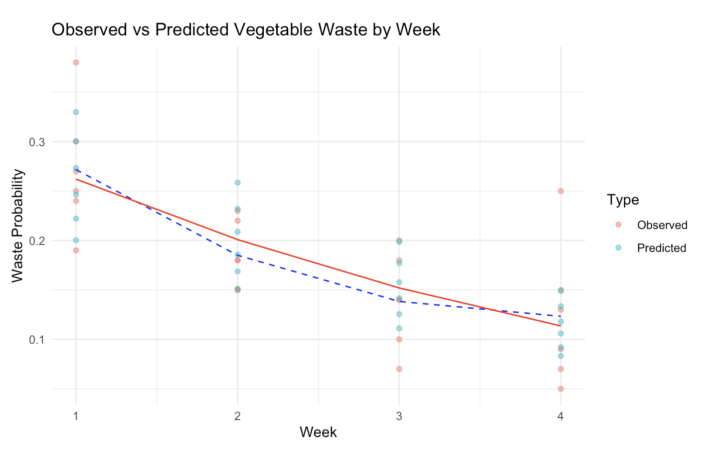
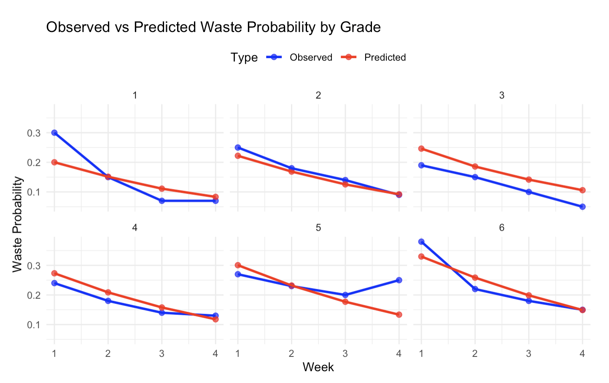

# README
This code analyzes vegetable waste by grade and week using Bayesian modeling in Stan, with R for data prep, prior estimation, and visualization. It predicts waste probability, compares observed vs. predicted values, and plots trends over weeks and grades.

## Purpose
Update vegetable waste predictions using posterior data.

## Statistical Techniques:
- Bayesian inference with Stan (Models uncertainty in waste probability).
- Beta distribution for waste probability (Fits 0-1 ratio data, versatile shapes).
- Logistic regression for Grade and Week (Models decreasing trends with S-curve).
- Prior estimation from mean and variance (Sets grade-specific priors).
- MCMC sampling for posterior predictions (Handles complex distributions, uncertainty).

## Output
- Enhanced waste trend predictions by week and grade.
1. Change Over Weeks (Mean Predicted Values)
    
2. Separate Graphs for Each Grade
    
3. Compare Observed vs Predicted Values (Mean by Grade)
    
